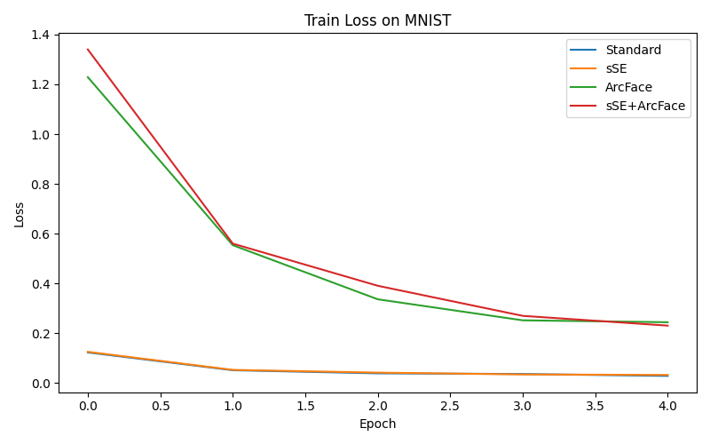

# Modified ResNet Exploration

Tests sSE and ArcFace loss on ResNet for classical object classification tasks.

Original Inspiration from [A Face Recognition Algorithm Based on Improved Resnet](https://drpress.org/ojs/index.php/fcis/article/view/1100) by Jing et al. 2022

## Results
### MNIST
#### Test Accuracy
- Standard ResNet: `0.991`
- With sSE: `0.9898`
- With ArcFace Loss: `0.9813`
- With sSE + ArcFace Loss: `0.9696`

#### Training Loss

### Fashion-MNIST
#### Test Accuracy
- Standard ResNet: `0.9034`
- With sSE: `0.904`
- With ArcFace Loss: `0.8315`
- With sSE + ArcFace Loss: `0.8422`

#### Training Loss

### CIFAR10
#### Test Accuracy
- Standard ResNet: `0.7195`
- With sSE: `0.7333`
- With ArcFace Loss: `0.9952`
- With sSE + ArcFace Loss: `0.9846`

#### Training Loss

### CIFAR100
#### Test Accuracy
- Standard ResNet: `0.4089`
- With sSE: `0.4127`
- With ArcFace Loss: `0.9904`
- With sSE + ArcFace Loss: `0.986`

#### Training Loss

## Development
### Setup Steps
- `python -m venv venv` - Create a venv for the project
- `venv\Scripts\activate` - Activate the venv (Windows)
- `pip install -r requirements.txt` - Install the required packages
- `python compare_resnets.py` - Runs the trainer on all models
  - `--datasets` - Specify which datasets you want to train on (MNIST, FashionMNIST, CIFAR10, CIFAR100) (default all)
  - `--epochs` - How many epochs (default 5)
  - `--seed` - The seed for the random number generator (default 42)

Development was done on Windows, and all training was done on Google Colab T4.

### File Structure
- `custom_models/` - All of the model code for the project
  - `components/` - The custom components to test the ResNet changes
    - `arc_face_head.py` - The head to calculate the loss for ArcFace
    - `sse_block.py` - The Squeeze and Excitation Block for sSE
  - `resnet_arc.py` - ResNet with ArcFace loss
  - `resnet_sse_arc.py` - ResNet with both sSE and ArcFace loss
  - `resnet_sse.py` - ResNet with sSE
  - `resnet.py` - Standard ResNet
- `logs/` - The log folders for each dataset
- `compare_resnets.py` - Trains all models on the provided datasets
- `dataloader.py` - Loads the datasets from PyTorch
- `requirements.txt` - The required libraries to install to run the project

## Links
Based on:
- [ArcFace: Additive Angular Margin Loss for Deep Face Recognition](https://ieeexplore.ieee.org/document/8953658) by Deng et al. 2019
- [Recalibrating Fully Convolutional Networks With Spatial and Channel “Squeeze and Excitation” Blocks](https://ieeexplore.ieee.org/document/8447284) by Roy et al. 2018

Tested on the following datasets:
- [MNIST](https://ieeexplore.ieee.org/document/726791)
- [Fashion-MNIST](https://github.com/zalandoresearch/fashion-mnist)
- [CIFAR10 & CIFAR100](https://www.cs.toronto.edu/~kriz/cifar.html)
